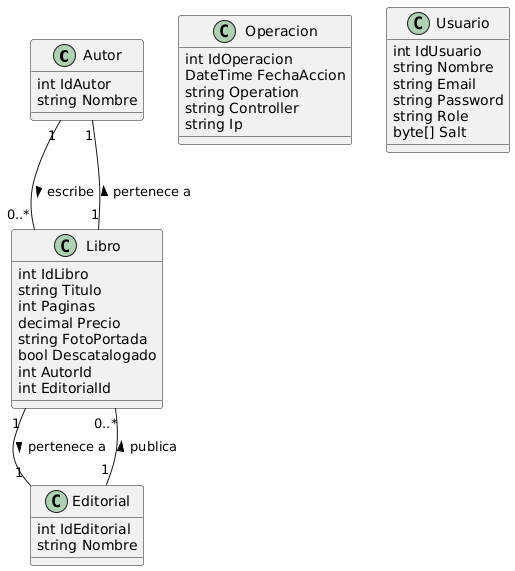

## Biblioteca

**Biblioteca** is an ASP.NET Core Web API designed to manage library operations including books (Libro), authors (Autor), and publishers (Editorial).



Biblioteca/  
├── AutoMappers/  
│   └── MappingProfile.cs  
├── Clases/  
│   └── ResultadoHash.cs  
├── Controllers/  
│   ├── AuthController.cs  
│   ├── AutoresController.cs  
│   ├── EditorialesController.cs  
│   ├── LibrosController.cs  
│   ├── OperacionesController.cs  
│   └── UsuariosController.cs  
├── DTOs/  
│   ├── AutorDTO.cs  
│   ├── AutorInsertDTO.cs  
│   ├── AutorLibroDTO.cs  
│   ├── AutorUpdateDTO.cs  
│   ├── EditorialDTO.cs  
│   ├── EditorialInsertDTO.cs  
│   ├── EditorialLibroAutorDTO.cs  
│   ├── EditorialLibroDTO.cs  
│   ├── EditorialUpdateDTO.cs  
│   ├── LibroDTO.cs  
│   ├── LibroGroupDTO.cs  
│   ├── LibroInsertDTO.cs  
│   ├── LibroItemDTO.cs  
│   ├── LibroUpdateDTO.cs  
│   ├── LibroVentaDTO.cs  
│   ├── LoginResponseDTO.cs  
│   ├── UsuarioChangePasswordDTO.cs  
│   └── UsuarioDTO.cs  
├── Models/  
│   ├── Autor.cs  
│   ├── BibliotecaContext.cs  
│   ├── Editorial.cs  
│   ├── Libro.cs  
│   ├── Operacion.cs  
│   └── Usuario.cs  
├── Repository/  
│   ├── AutorRepository.cs  
│   ├── EditorialRepository.cs  
│   ├── IAutorRepository.cs  
│   ├── IBaseRepository.cs  
│   ├── IEditorialRepository.cs  
│   ├── ILibroRepository.cs  
│   └── LibroRepository.cs  
├── Services/  
│   ├── AutorService.cs  
│   ├── EditorialService.cs  
│   ├── GestorArchivos.cs  
│   ├── HashService.cs  
│   ├── IAutorService.cs  
│   ├── ICommonServiceBase.cs  
│   ├── IEditorialService.cs  
│   ├── IGestorArchivos.cs  
│   ├── ILibroService.cs  
│   ├── ITokenService.cs  
│   ├── LibroService.cs  
│   ├── OperacionesService.cs   
│   └── TokenService.cs    
├── Validators/  
│   ├── AutorInsertValidator.cs  
│   ├── AutorUpdateValidator.cs  
│   ├── EditorialInsertValidator.cs  
│   ├── EditorialUpdateValidator.cs  
│   ├── GrupoTipoArchivo.cs  
│   ├── LibroInsertValidator.cs  
│   ├── LibroUpdateValidator.cs  
│   ├── PaginasNoNegativasValidacion.cs  
│   ├── PesoArchivoValidacion.cs  
│   └── TipoArchivoValidacion.cs  
├── Properties/  
│   └── launchSettings.json  
├── wwwroot/  
├── appsettings.json  
├── Program.cs  
└── Biblioteca.csproj  


## Program
```cs 
builder.Services.AddDbContext<AlmacenContext>(options =>
    options.UseSqlServer(builder.Configuration.GetConnectionString("Connection"))
);
``` 

## appsetting.Development.json
```cs 
{
  "ConnectionStrings": {
        "Connection": "Server=*;Database=Biblioteca;Trusted_Connection=True;TrustServerCertificate=True;MultipleActiveResultSets=True"
}
``` 

[DeepWiki moraisLuismNet/Biblioteca](https://deepwiki.com/moraisLuismNet/Biblioteca)